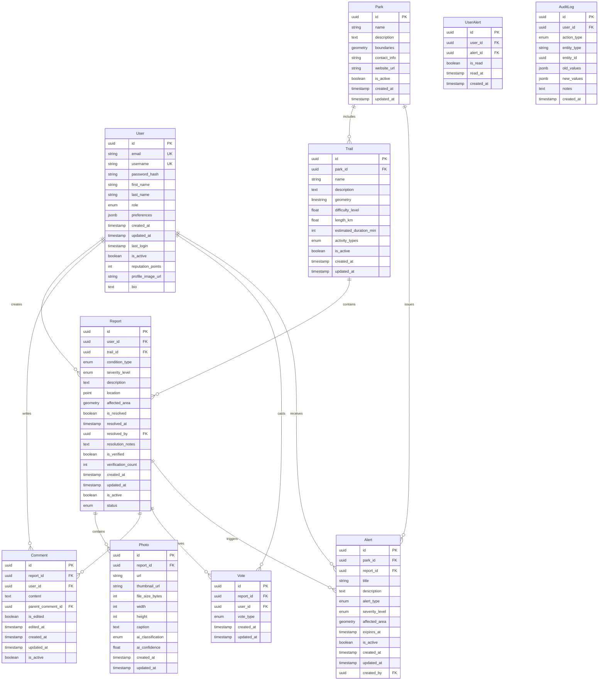

# Database Schema Design

## Overview

The Trail Safety Platform uses PostgreSQL as the primary database with Prisma ORM for type-safe database operations.

## Entity Relationship Diagram



## Table Definitions

### Users

```sql
CREATE TABLE users (
    id UUID PRIMARY KEY DEFAULT gen_random_uuid(),
    email VARCHAR(255) UNIQUE NOT NULL,
    username VARCHAR(50) UNIQUE NOT NULL,
    password_hash VARCHAR(255) NOT NULL,
    first_name VARCHAR(100),
    last_name VARCHAR(100),
    role user_role DEFAULT 'user',
    preferences JSONB DEFAULT '{}',
    created_at TIMESTAMP WITH TIME ZONE DEFAULT NOW(),
    updated_at TIMESTAMP WITH TIME ZONE DEFAULT NOW(),
    last_login TIMESTAMP WITH TIME ZONE,
    is_active BOOLEAN DEFAULT true,
    reputation_points INTEGER DEFAULT 0,
    profile_image_url TEXT,
    bio TEXT
);

CREATE TYPE user_role AS ENUM ('user', 'moderator', 'admin');
```

### Parks

```sql
CREATE TABLE parks (
    id UUID PRIMARY KEY DEFAULT gen_random_uuid(),
    name VARCHAR(255) NOT NULL,
    description TEXT,
    boundaries GEOMETRY(POLYGON, 4326),
    contact_info TEXT,
    website_url TEXT,
    is_active BOOLEAN DEFAULT true,
    created_at TIMESTAMP WITH TIME ZONE DEFAULT NOW(),
    updated_at TIMESTAMP WITH TIME ZONE DEFAULT NOW()
);
```

### Trails

```sql
CREATE TABLE trails (
    id UUID PRIMARY KEY DEFAULT gen_random_uuid(),
    park_id UUID NOT NULL REFERENCES parks(id) ON DELETE CASCADE,
    name VARCHAR(255) NOT NULL,
    description TEXT,
    geometry GEOMETRY(LINESTRING, 4326),
    difficulty_level DECIMAL(2,1) CHECK (difficulty_level >= 1 AND difficulty_level <= 10),
    length_km DECIMAL(8,2),
    estimated_duration_min INTEGER,
    activity_types activity_type[],
    is_active BOOLEAN DEFAULT true,
    created_at TIMESTAMP WITH TIME ZONE DEFAULT NOW(),
    updated_at TIMESTAMP WITH TIME ZONE DEFAULT NOW()
);

CREATE TYPE activity_type AS ENUM ('hiking', 'running', 'cycling', 'horseback', 'skiing', 'snowshoeing');
```

### Reports

```sql
CREATE TABLE reports (
    id UUID PRIMARY KEY DEFAULT gen_random_uuid(),
    user_id UUID NOT NULL REFERENCES users(id) ON DELETE CASCADE,
    trail_id UUID REFERENCES trails(id) ON DELETE SET NULL,
    condition_type condition_type NOT NULL,
    severity_level severity_level NOT NULL,
    description TEXT,
    location GEOMETRY(POINT, 4326) NOT NULL,
    affected_area GEOMETRY(POLYGON, 4326),
    is_resolved BOOLEAN DEFAULT false,
    resolved_at TIMESTAMP WITH TIME ZONE,
    resolved_by UUID REFERENCES users(id) ON DELETE SET NULL,
    resolution_notes TEXT,
    is_verified BOOLEAN DEFAULT false,
    verification_count INTEGER DEFAULT 0,
    created_at TIMESTAMP WITH TIME ZONE DEFAULT NOW(),
    updated_at TIMESTAMP WITH TIME ZONE DEFAULT NOW(),
    is_active BOOLEAN DEFAULT true,
    status report_status DEFAULT 'active'
);

CREATE TYPE condition_type AS ENUM (
    'fallen_tree', 'mud', 'flooding', 'ice', 'snow', 'rock_slide', 
    'wildlife', 'bridge_damage', 'trail_closure', 'erosion', 'debris',
    'construction', 'maintenance', 'other'
);

CREATE TYPE severity_level AS ENUM ('low', 'medium', 'high', 'critical');

CREATE TYPE report_status AS ENUM ('active', 'resolved', 'archived', 'duplicate');
```

### Photos

```sql
CREATE TABLE photos (
    id UUID PRIMARY KEY DEFAULT gen_random_uuid(),
    report_id UUID NOT NULL REFERENCES reports(id) ON DELETE CASCADE,
    url TEXT NOT NULL,
    thumbnail_url TEXT,
    file_size_bytes INTEGER,
    width INTEGER,
    height INTEGER,
    caption TEXT,
    ai_classification ai_classification_type,
    ai_confidence DECIMAL(3,2),
    created_at TIMESTAMP WITH TIME ZONE DEFAULT NOW(),
    updated_at TIMESTAMP WITH TIME ZONE DEFAULT NOW()
);

CREATE TYPE ai_classification_type AS ENUM (
    'fallen_tree', 'mud', 'flooding', 'ice', 'snow', 'rock_slide',
    'wildlife', 'bridge_damage', 'trail_closure', 'clear_trail', 'unknown'
);
```

### Comments

```sql
CREATE TABLE comments (
    id UUID PRIMARY KEY DEFAULT gen_random_uuid(),
    report_id UUID NOT NULL REFERENCES reports(id) ON DELETE CASCADE,
    user_id UUID NOT NULL REFERENCES users(id) ON DELETE CASCADE,
    content TEXT NOT NULL,
    parent_comment_id UUID REFERENCES comments(id) ON DELETE CASCADE,
    is_edited BOOLEAN DEFAULT false,
    edited_at TIMESTAMP WITH TIME ZONE,
    created_at TIMESTAMP WITH TIME ZONE DEFAULT NOW(),
    updated_at TIMESTAMP WITH TIME ZONE DEFAULT NOW(),
    is_active BOOLEAN DEFAULT true
);
```

### Votes

```sql
CREATE TABLE votes (
    id UUID PRIMARY KEY DEFAULT gen_random_uuid(),
    report_id UUID NOT NULL REFERENCES reports(id) ON DELETE CASCADE,
    user_id UUID NOT NULL REFERENCES users(id) ON DELETE CASCADE,
    vote_type vote_type NOT NULL,
    created_at TIMESTAMP WITH TIME ZONE DEFAULT NOW(),
    updated_at TIMESTAMP WITH TIME ZONE DEFAULT NOW(),
    UNIQUE(report_id, user_id)
);

CREATE TYPE vote_type AS ENUM ('confirm', 'dispute', 'helpful');
```

### Alerts

```sql
CREATE TABLE alerts (
    id UUID PRIMARY KEY DEFAULT gen_random_uuid(),
    park_id UUID REFERENCES parks(id) ON DELETE CASCADE,
    report_id UUID REFERENCES reports(id) ON DELETE SET NULL,
    title VARCHAR(255) NOT NULL,
    description TEXT,
    alert_type alert_type NOT NULL,
    severity_level severity_level NOT NULL,
    affected_area GEOMETRY(POLYGON, 4326),
    expires_at TIMESTAMP WITH TIME ZONE,
    is_active BOOLEAN DEFAULT true,
    created_at TIMESTAMP WITH TIME ZONE DEFAULT NOW(),
    updated_at TIMESTAMP WITH TIME ZONE DEFAULT NOW(),
    created_by UUID NOT NULL REFERENCES users(id) ON DELETE SET NULL
);

CREATE TYPE alert_type AS ENUM ('weather', 'hazard', 'closure', 'maintenance', 'emergency');
```

### User Alerts (Join Table)

```sql
CREATE TABLE user_alerts (
    id UUID PRIMARY KEY DEFAULT gen_random_uuid(),
    user_id UUID NOT NULL REFERENCES users(id) ON DELETE CASCADE,
    alert_id UUID NOT NULL REFERENCES alerts(id) ON DELETE CASCADE,
    is_read BOOLEAN DEFAULT false,
    read_at TIMESTAMP WITH TIME ZONE,
    created_at TIMESTAMP WITH TIME ZONE DEFAULT NOW(),
    UNIQUE(user_id, alert_id)
);
```

### Audit Log

```sql
CREATE TABLE audit_logs (
    id UUID PRIMARY KEY DEFAULT gen_random_uuid(),
    user_id UUID REFERENCES users(id) ON DELETE SET NULL,
    action_type action_type NOT NULL,
    entity_type VARCHAR(50) NOT NULL,
    entity_id UUID NOT NULL,
    old_values JSONB,
    new_values JSONB,
    notes TEXT,
    created_at TIMESTAMP WITH TIME ZONE DEFAULT NOW()
);

CREATE TYPE action_type AS ENUM (
    'create', 'update', 'delete', 'resolve', 'verify', 'moderate',
    'login', 'logout', 'register', 'password_reset'
);
```

## Indexes

```sql
-- User indexes
CREATE INDEX idx_users_email ON users(email);
CREATE INDEX idx_users_username ON users(username);
CREATE INDEX idx_users_role ON users(role);

-- Report indexes
CREATE INDEX idx_reports_user_id ON reports(user_id);
CREATE INDEX idx_reports_trail_id ON reports(trail_id);
CREATE INDEX idx_reports_condition_type ON reports(condition_type);
CREATE INDEX idx_reports_severity_level ON reports(severity_level);
CREATE INDEX idx_reports_created_at ON reports(created_at);
CREATE INDEX idx_reports_location ON reports USING GIST(location);
CREATE INDEX idx_reports_status ON reports(status);

-- Photo indexes
CREATE INDEX idx_photos_report_id ON photos(report_id);
CREATE INDEX idx_photos_ai_classification ON photos(ai_classification);

-- Comment indexes
CREATE INDEX idx_comments_report_id ON comments(report_id);
CREATE INDEX idx_comments_user_id ON comments(user_id);
CREATE INDEX idx_comments_parent_comment_id ON comments(parent_comment_id);

-- Vote indexes
CREATE INDEX idx_votes_report_id ON votes(report_id);
CREATE INDEX idx_votes_user_id ON votes(user_id);

-- Alert indexes
CREATE INDEX idx_alerts_park_id ON alerts(park_id);
CREATE INDEX idx_alerts_report_id ON alerts(report_id);
CREATE INDEX idx_alerts_expires_at ON alerts(expires_at);
CREATE INDEX idx_alerts_affected_area ON alerts USING GIST(affected_area);

-- Trail indexes
CREATE INDEX idx_trails_park_id ON trails(park_id);
CREATE INDEX idx_trails_geometry ON trails USING GIST(geometry);

-- Park indexes
CREATE INDEX idx_parks_boundaries ON parks USING GIST(boundaries);

-- Audit log indexes
CREATE INDEX idx_audit_logs_user_id ON audit_logs(user_id);
CREATE INDEX idx_audit_logs_entity_type_id ON audit_logs(entity_type, entity_id);
CREATE INDEX idx_audit_logs_created_at ON audit_logs(created_at);
```

## Triggers

```sql
-- Update updated_at timestamp
CREATE OR REPLACE FUNCTION update_updated_at_column()
RETURNS TRIGGER AS $$
BEGIN
    NEW.updated_at = NOW();
    RETURN NEW;
END;
$$ language 'plpgsql';

-- Apply to relevant tables
CREATE TRIGGER update_users_updated_at BEFORE UPDATE ON users
    FOR EACH ROW EXECUTE FUNCTION update_updated_at_column();

CREATE TRIGGER update_parks_updated_at BEFORE UPDATE ON parks
    FOR EACH ROW EXECUTE FUNCTION update_updated_at_column();

CREATE TRIGGER update_trails_updated_at BEFORE UPDATE ON trails
    FOR EACH ROW EXECUTE FUNCTION update_updated_at_column();

CREATE TRIGGER update_reports_updated_at BEFORE UPDATE ON reports
    FOR EACH ROW EXECUTE FUNCTION update_updated_at_column();

CREATE TRIGGER update_photos_updated_at BEFORE UPDATE ON photos
    FOR EACH ROW EXECUTE FUNCTION update_updated_at_column();

CREATE TRIGGER update_comments_updated_at BEFORE UPDATE ON comments
    FOR EACH ROW EXECUTE FUNCTION update_updated_at_column();

CREATE TRIGGER update_votes_updated_at BEFORE UPDATE ON votes
    FOR EACH ROW EXECUTE FUNCTION update_updated_at_column();

CREATE TRIGGER update_alerts_updated_at BEFORE UPDATE ON alerts
    FOR EACH ROW EXECUTE FUNCTION update_updated_at_column();

-- Update verification count on reports
CREATE OR REPLACE FUNCTION update_report_verification_count()
RETURNS TRIGGER AS $$
BEGIN
    IF TG_OP = 'INSERT' THEN
        UPDATE reports 
        SET verification_count = verification_count + 1,
            is_verified = verification_count + 1 >= 3
        WHERE id = NEW.report_id;
        RETURN NEW;
    ELSIF TG_OP = 'DELETE' THEN
        UPDATE reports 
        SET verification_count = verification_count - 1,
            is_verified = verification_count - 1 >= 3
        WHERE id = OLD.report_id;
        RETURN OLD;
    END IF;
    RETURN NULL;
END;
$$ language 'plpgsql';

CREATE TRIGGER update_verification_count_trigger
    AFTER INSERT OR DELETE ON votes
    FOR EACH ROW EXECUTE FUNCTION update_report_verification_count();
```

## Data Validation Constraints

```sql
-- Email validation
ALTER TABLE users ADD CONSTRAINT valid_email 
    CHECK (email ~* '^[A-Za-z0-9._%+-]+@[A-Za-z0-9.-]+\.[A-Za-z]{2,}$');

-- Username validation
ALTER TABLE users ADD CONSTRAINT valid_username 
    CHECK (username ~* '^[a-zA-Z0-9_]{3,30}$');

-- Report description length
ALTER TABLE reports ADD CONSTRAINT description_length 
    CHECK (LENGTH(description) <= 1000);

-- Comment content length
ALTER TABLE comments ADD CONSTRAINT comment_length 
    CHECK (LENGTH(content) <= 500);

-- Photo aspect ratio validation
ALTER TABLE photos ADD CONSTRAINT valid_dimensions 
    CHECK (width > 0 AND height > 0);
```

## PostGIS Setup

```sql
-- Enable PostGIS extension
CREATE EXTENSION IF NOT EXISTS postgis;
CREATE EXTENSION IF NOT EXISTS postgis_topology;

-- Set spatial reference system
INSERT INTO spatial_ref_sys (srid, auth_name, auth_srid, proj4text, srtext)
VALUES (4326, 'EPSG', 4326, '+proj=longlat +datum=WGS84 +no_defs', 
        'GEOGCS["WGS 84",DATUM["WGS_1984",SPHEROID["WGS 84",6378137,298.257223563,AUTHORITY["EPSG","7030"]],AUTHORITY["EPSG","6326"]],PRIMEM["Greenwich",0,AUTHORITY["EPSG","8901"]],UNIT["degree",0.01745329251994328,AUTHORITY["EPSG","9122"]],AUTHORITY["EPSG","4326"]]')
ON CONFLICT (srid) DO NOTHING;
```

## Prisma Schema

```prisma
// This is a simplified version for the Prisma schema file
generator client {
  provider = "prisma-client-js"
}

datasource db {
  provider = "postgresql"
  url      = env("DATABASE_URL")
}

model User {
  id                String    @id @default(uuid())
  email             String    @unique
  username          String    @unique
  passwordHash      String    @map("password_hash")
  firstName         String?   @map("first_name")
  lastName          String?   @map("last_name")
  role              UserRole  @default(USER)
  preferences       Json      @default("{}")
  createdAt         DateTime  @default(now()) @map("created_at")
  updatedAt         DateTime  @updatedAt @map("updated_at")
  lastLogin         DateTime? @map("last_login")
  isActive          Boolean   @default(true) @map("is_active")
  reputationPoints  Int       @default(0) @map("reputation_points")
  profileImageUrl   String?   @map("profile_image_url")
  bio               String?

  reports           Report[]
  comments          Comment[]
  votes             Vote[]
  userAlerts        UserAlert[]
  createdReports    Report[]  @relation("ResolvedBy")
  createdAlerts     Alert[]

  @@map("users")
}

enum UserRole {
  USER
  MODERATOR
  ADMIN
}

// Additional models would follow the same pattern...
```

## Performance Considerations

1. **Geospatial Queries**: Use GIST indexes for all geometry columns
2. **Time-based Queries**: Index on created_at for filtering by date ranges
3. **User Activity**: Composite indexes for user-specific queries
4. **Photo Storage**: Consider CDN integration for large files
5. **Caching**: Implement Redis caching for frequently accessed data

## Backup and Recovery

1. **Daily Backups**: Automated daily database backups
2. **Point-in-Time Recovery**: Enable WAL archiving
3. **Replication**: Read replicas for improved performance
4. **Monitoring**: Database performance monitoring and alerting
